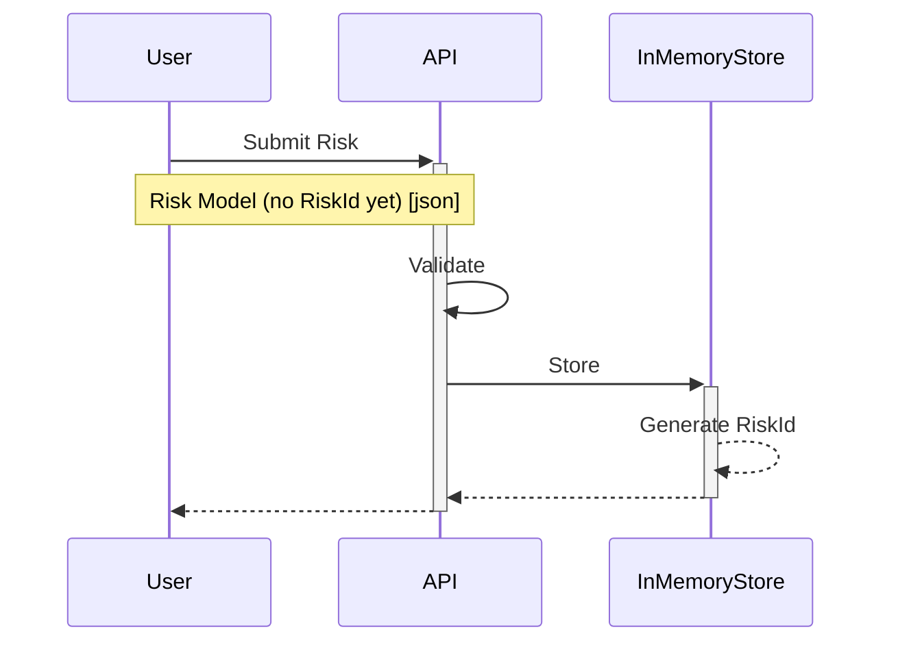
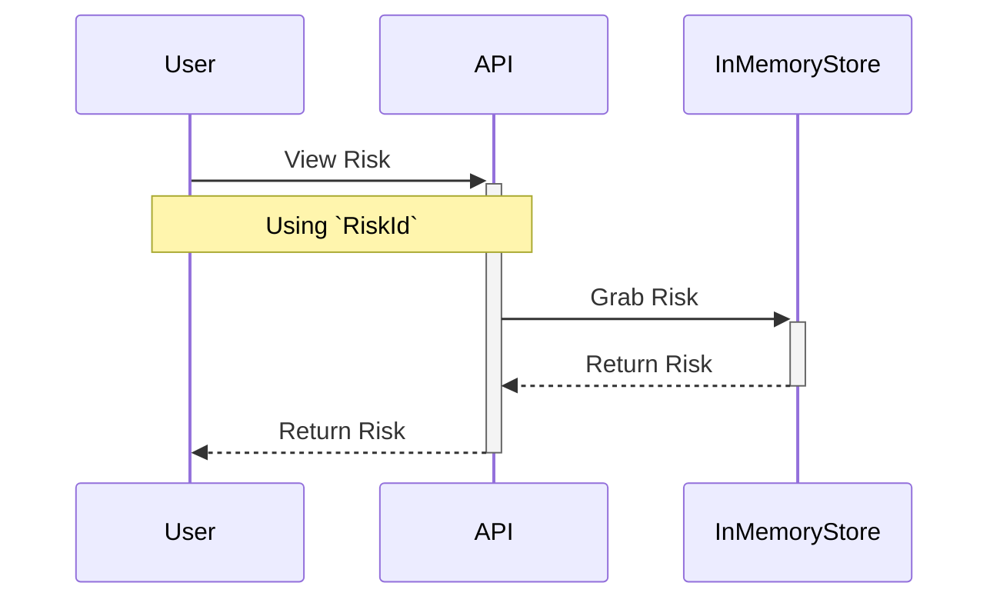
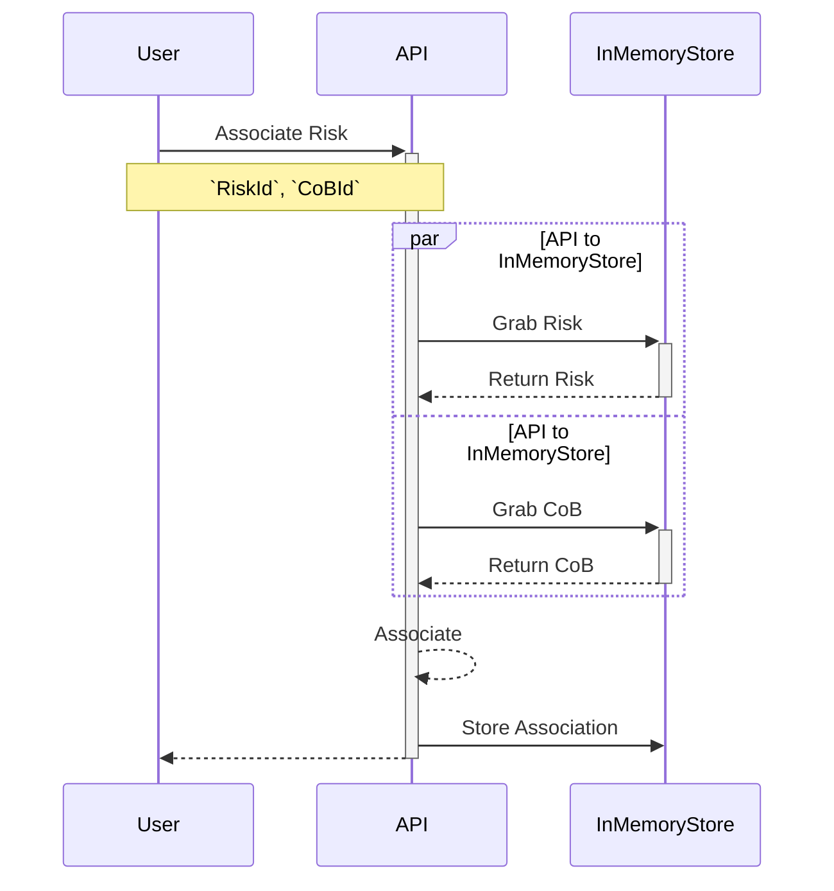
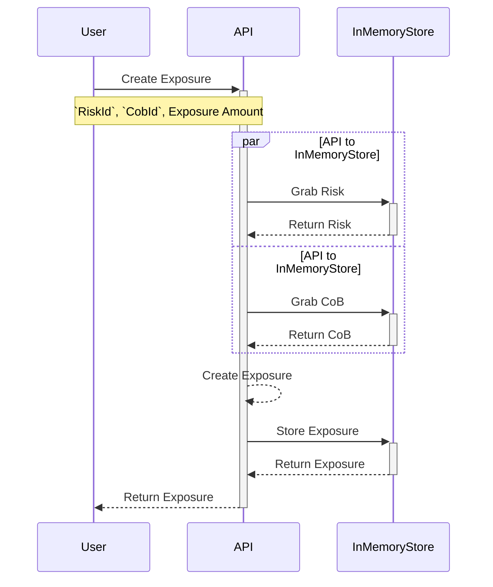
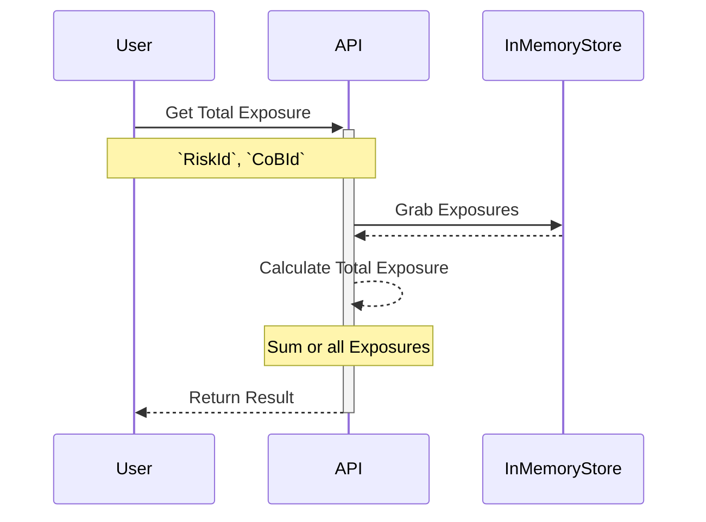
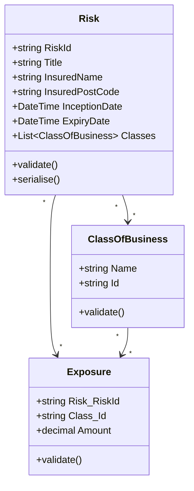

# Insurers Portal Example

## Context

In the specialty insurance market, Insurers (or "carriers") provide the working capital funds to cover insurable events when claims arise from an insurable event. For example an insurer may provide cover for a hotel property (a risk) of up to 10 million pounds for a storm event. If the event occurs, the Insurer would incur a loss, anywhere up to that limit. In complex risks with high values, such as those that InsurX helps to trade, no single insurer would take on all of the potential loss - so they would join together with other Insurers to form a syndicate that would cover the needs of the risk.

## Scenario

In our hypothetical scenario, we are looking to build an Insurer Portal. This portal will serve as a place where our insurer partners can view the risks, and exposures, that we have arranged on their behalf.

We need you to begin building the APIs that will power this portal.

Please review the material below on what to build out:

## The Task

Spend as much or as little time as you would like covering the following

  1. Implement a basic API (database not needed, in memory is fine)
  2. Use the diagrams to understand flow

Things to consider

  - What practices and patterns are appropriate for the scenario?
  - How do you ensure quality?
  - Good enough is just fine.
  - You don't need to make it "production ready", but you will need to understand how to go about making it so

As part of your upcoming interview we will be discussing your approach and implementation, and potentially extending it further together as a pair programming exercise. 

We use .NET and C# primarily for building APIs at InsurX, but you may use whatever language you feel is appropriate to achieve your implementation.

## Flows

As a user when I have a *new* risk I would like to save it:

As a user I would like to see a risk when I've created it:

As a user I would like to associate a Risk with a Class of Business (CoB):

As a user I would like set an exposure for a Risk and Class of Business:

As a user I would like to get a total exposure amount for a Risk and Class of Business:

## Data Model

Risks can be associated with any number of Classes of Business, and an Exposure is associated with a single Risk and a single Class of Business.

